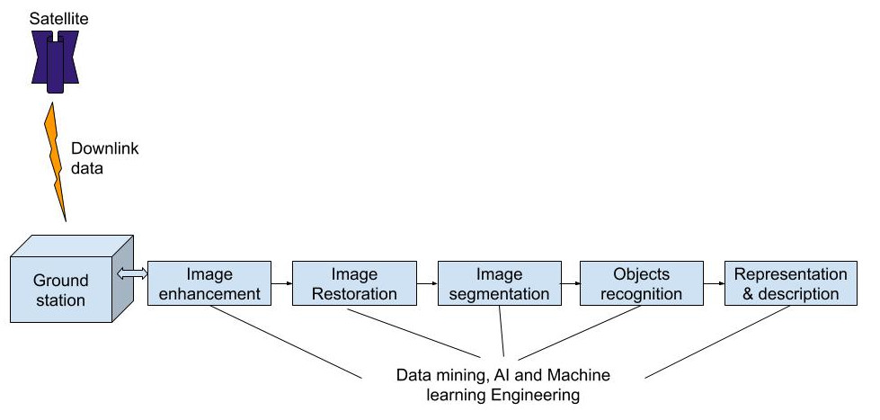
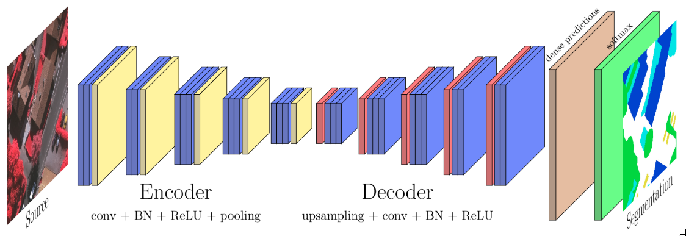
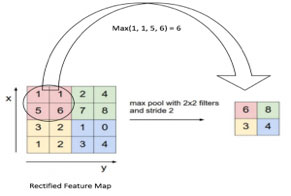

# Satellite image analysis and processing

Satellite mapping is way easier than traditional cartographic methods, but still, the main challenge is in recognizing particular objects in the image, like roads, buildings and landmarks. Getting up-to-date information about roadblocks and threats is even more essential. And that’s where machine learning-based solutions come into play.

- Image enhancement: improve the quality of image
- Image restoration: restore degraded images
- Object detection: AI algorithms for detection, segmentation, captioning and classification
- Representation and description

Many applications could benefit from automatic analysis of satellite images : cartography, urban planning, traffic analysis, biomass estimation and so on. Therefore, lots of progresses have been made to use machine learning to help us have a better understanding of our Earth Observation data.

In this project, I show that deep learning allows a computer to parse and classify objects in an image and can be used for automatical cartography from remote sensing data. Especially, I provide examples of deep fully convolutional networks that can be trained for semantic labeling for airborne pictures of urban areas.

### Satellite image segmentation

Image Segmentation is a topic of machine learning where one needs to not only categorize what’s seen in an image, but to also do it on a per-pixel level. Here, I want to go from a satellite image to a map representation where things in the image are automatically categorized just like generating a map view automatically from satellite images.

#### Network architecture
A convolution is an operation that changes a function into something else. We do convolutions so that we can transform the original function into a form to get more information.

Convolutions have been used for a long time in image processing to blur and sharpen images, and perform other operations, such as, enhance edges and emboss.

A baseline fully-convolutional network uses a simple encoder-decoder framework to solve semantic segmentation tasks. It consists of only convolutional and pooling layers, without any fully connected layers. This allows it to make predictions on arbitrary-sized inputs. By propagating an image through several pooling layers, the resolution of feature maps is downsampled, which, due to information loss during pooling operations, results in low-resolution, coarse segmentation maps.

1. Convolutional Layer: A convolution operation is an element wise matrix multiplication operation. Where one of the matrices is the image, and the other is the filter or kernel that turns the image into something else. The output of this is the final convoluted image.

The job of the convolutional layer is feature extraction. It learns to find spatial features in an input image. This layer is produced by applying a series of different image filters to an input image. These filters are known as convolutional kernels. A filter is a small grid of values that slides over the input image pixel by pixel to produce a filtered output image that will be of the same size as the input image.  Multiple kernels will produce different filtered output images.

2. Pooling Layer: After the convolutional layer comes the pooling layer; the most common type of pooling layer is maxpooling layer. The main goal of the pooling layer is dimensionality reduction, meaning reducing the size of an image by taking the max value from the window. A maxpooling operation breaks an image into smaller patches. A maxpooling layer is defined by a patch size and stride. For a patch size of 2×2 and a stride of 2, this window will perfectly cover the image. A smaller stride would see some overlap in patches and a larger stride would miss some pixels entirely. So, we generally see a patch size and a stride size that are the same.

1. Satellite image segmentation

2. Satellite image captioning
